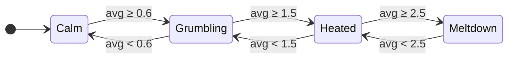

# WTF meter


In 2008 Thom Holwerda drew the definitive code quality metric for [OSNews](https://www.osnews.com/story/19557/Fools): two doors marked CODE REVIEW, and the only number that matters is how many WTFs per minute come out from behind them. Robert C. Martin opened *Clean Code* with it.

The code review is a chat with Claude now, and the WTFs are typed. So this is a Claude Code mod that counts them, live, per message: in English, German, Polish, Russian and Ukrainian.


**What you get**

- Every message where you swore gets stamped: `[WTF +3 · бля]`
- A strip above the prompt tracks the heat, one bar per message
- The status line keeps score: `WTF 9 · 3.0/msg ▲ Meltdown`
- A toast pops when the session changes level
- `/wtf` prints the tally

Works in the Claude Code terminal and the Code tab of the Claude desktop app. Nothing leaves your machine.

<br clear="right">

## The four stages of a Claude Code session


The level is the average score of your last 4 messages, so one truly bad message can skip a stage.



## Install

Needs a Claude Code build with function-hook mods (early access; built against 2.1.293).

```
/plugin marketplace add dreamiurg/wtf-meter
/plugin install wtf-meter@wtf-meter
```

Or from a shell:

```bash
claude plugin marketplace add dreamiurg/wtf-meter
claude plugin install wtf-meter@wtf-meter
```

Start a new session after installing.

## Scoring

Every word in [`hooks/lexicon.ts`](hooks/lexicon.ts) has a weight: 1 mild (`damn`, `kurde`, `блин`), 2 medium (`wtf`, `verdammt`, `сука`), 3 strong (the f-word, `kurwa`, `Scheiße`, the Russian and Ukrainian mat roots). Censored spellings that dictation tools produce (`f***`, `п***ц`) count too.

Russian and Ukrainian share most of the mat roots, so they share patterns. Each pattern needs a non-letter before it, because JavaScript's `\b` does not see Cyrillic. That keeps `hello`, `class`, `fickle`, `mister`, `корабля`, `Херсон` and `блины` clean. Known miss: `Ебург`.

Only what you type counts. Background task notifications, scheduled prompts and messages from other agents are skipped.

## Privacy

Scores live in the session's own state and go away with the session. The mod never changes what Claude reads: the stamps change only how your message is drawn.

## Develop

```bash
claude plugin validate .
claude plugin test .
```

Run a session with `claude --plugin-dir .` to load your working copy; saving a file reloads it. Disable the installed copy first (`/plugin disable wtf-meter@wtf-meter`), or every message counts twice. `tsc -p .` works after the first load, which lays the API types into `.claude-plugin/types/`.

## Credits

- The idea: Thom Holwerda's [WTFs/minute](https://www.osnews.com/story/19557/Fools) cartoon, OSNews, 2008. The drawings here are new homages generated with an image model, not copies; the prompts are in [docs/image-prompts.md](docs/image-prompts.md).

## License

MIT
