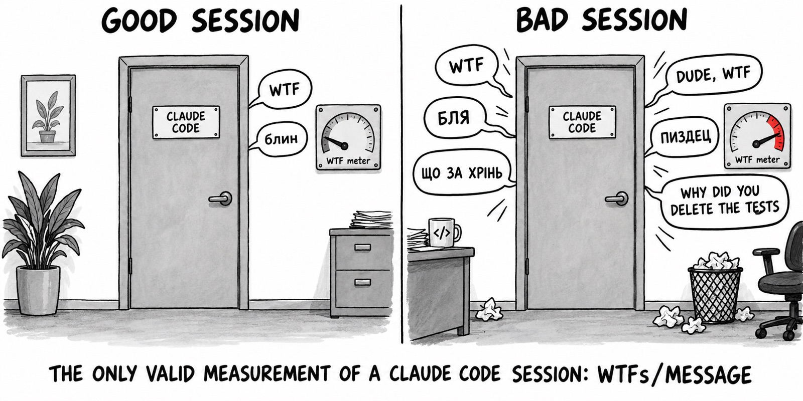
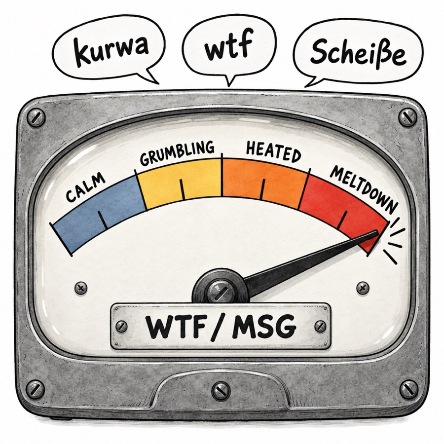
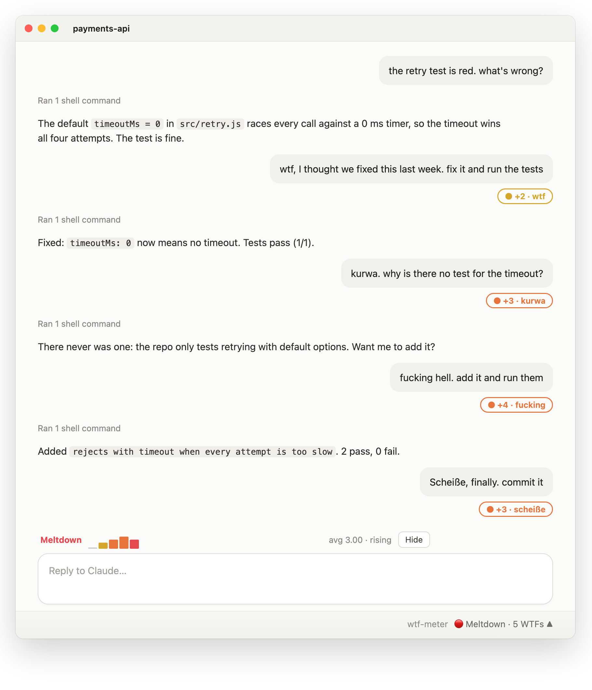
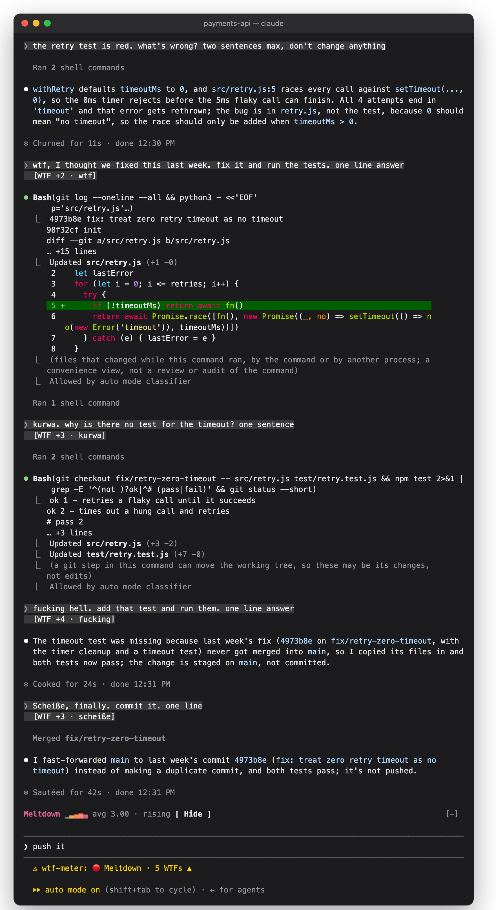
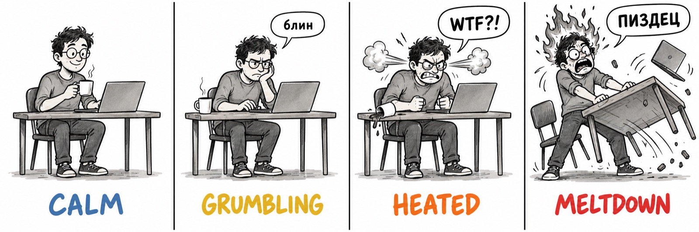
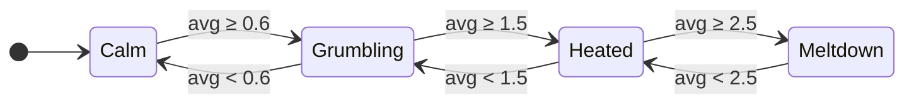
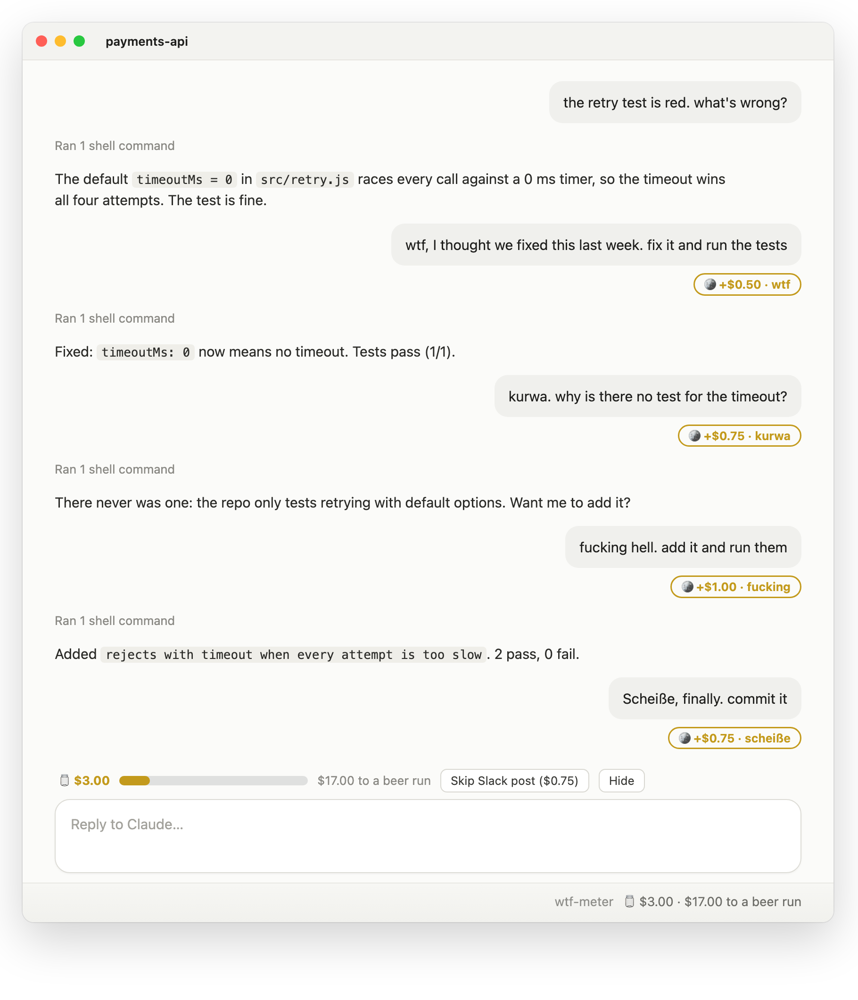
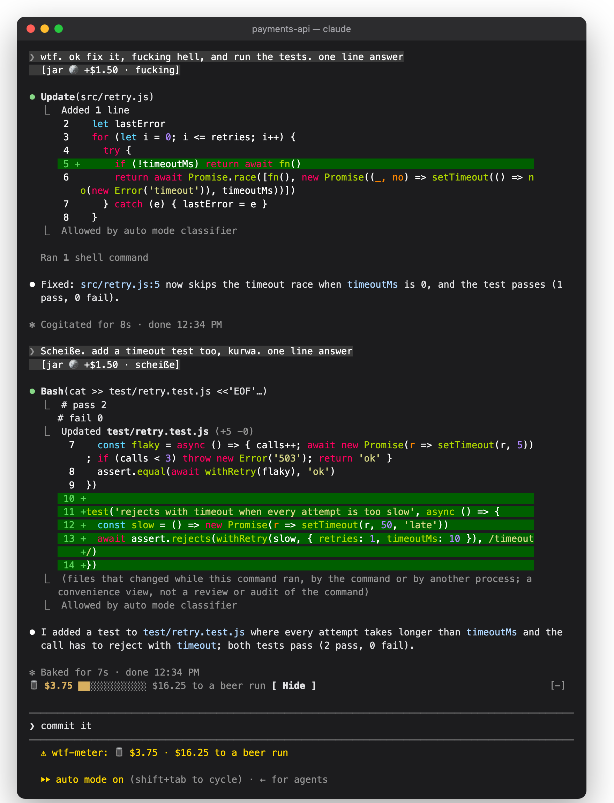
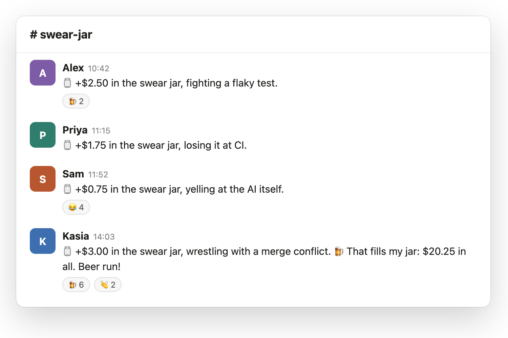

# WTF meter



In 2008 Thom Holwerda drew the definitive code quality metric for [OSNews](https://www.osnews.com/story/19557/Fools): two doors marked CODE REVIEW, and the only number that matters is how many WTFs per minute come out from behind them. Robert C. Martin opened *Clean Code* with it.

The code review is a chat with Claude now, and the WTFs are typed. So this is a Claude Code mod that counts them, live, per message: in English, German, Polish, Russian and Ukrainian.



**What you get**

- Every message where you swore gets stamped: `[WTF +3 · бля]`
- A strip above the prompt tracks the heat, one bar per message
- The status line keeps score: `WTF 9 · 3.0/msg ▲ Meltdown`
- A toast pops when the session changes level
- `/wtf` prints the tally
- Or switch to [swear jar mode](#swear-jar-mode) and let the team see who is paying in

Works in the Claude Code terminal and the Code tab of the Claude desktop app. Nothing leaves your machine unless you turn on Slack posting, and even then your words don't.

<br clear="right">

## See it

**In the Claude desktop app** (mockup of the Code tab: Claude's windows can't be screen-captured, so this is drawn from the mod's real output):



**In the terminal** (real session, captured from `claude` and rendered as-is):



## The four stages of a Claude Code session



The level is the average score of your last 4 messages, so one truly bad message can skip a stage.



## Swear jar mode

Inspired by Bud Light's "Swear Jar" ad: the office jar that paid for beer, until everyone started swearing on purpose. Switch `mode` to `jar` and every swear drops coins in, 25¢ per point (`damn` 25¢, `wtf` 50¢, `kurwa` 75¢). The jar never empties and carries over between sessions. Every $20 is a beer run.



<details><summary>Jar mode in the terminal (real session)</summary>



</details>

### Post to a team Slack channel

If Slack is connected in Claude (the Slack connector or the Slack plugin), the jar can post to a team channel as you:



**Your words never reach Slack.** A post is built only from the amount and one topic picked from a fixed list (`a flaky test`, `a deploy`, `CI`, `a merge conflict`, `the AI itself`, …; see [`hooks/jar.ts`](hooks/jar.ts)). A small model picks the topic, and any answer that is not exactly on the list becomes `something`. File names, project names, numbers and your actual message can't get into a post, whatever the model says.

Posts wait 2 minutes, so a burst of swearing becomes one post. `/wtf skip` or the strip's **Skip Slack post** button cancels the waiting post; the coins stay in your jar.

Setup: create the channel, then set two plugin options (`/config` in the terminal, or `~/.claude/settings.json`):

```json
"pluginConfigs": {
  "wtf-meter@wtf-meter": {
    "options": { "mode": "jar", "slackChannel": "swear-jar" }
  }
}
```

`slackChannel` takes a channel name or its ID (`C…`, from the channel's "Copy link"). Use the ID if the name matches more than one channel. No Slack connected: the jar stays local and a toast says so.

## Install

Needs a Claude Code build with function-hook mods (early access; built against 2.1.293).

```
/plugin marketplace add dreamiurg/wtf-meter
/plugin install wtf-meter@wtf-meter
```

Or from a shell:

```bash
claude plugin marketplace add dreamiurg/wtf-meter
claude plugin install wtf-meter@wtf-meter
```

Start a new session after installing.

## Scoring

Every word in [`hooks/lexicon.ts`](hooks/lexicon.ts) has a weight: 1 mild (`damn`, `kurde`, `блин`), 2 medium (`wtf`, `verdammt`, `сука`), 3 strong (the f-word, `kurwa`, `Scheiße`, the Russian and Ukrainian mat roots). Censored spellings that dictation tools produce (`f***`, `п***ц`) count too.

Russian and Ukrainian share most of the mat roots, so they share patterns. Each pattern needs a non-letter before it, because JavaScript's `\b` does not see Cyrillic. That keeps `hello`, `class`, `fickle`, `mister`, `корабля`, `Херсон` and `блины` clean. Known miss: `Ебург`.

Only what you type counts. Background task notifications, scheduled prompts and messages from other agents are skipped.

## Privacy

Meter scores live in the session's own state and go away with it; the jar total is kept in the plugin's local store. The stamps change only how your message is drawn: Claude still reads exactly what you typed. Slack posting is off until you set a channel, and a post never contains your words (see [swear jar mode](#swear-jar-mode)). Picking the topic is one small model call through your own Claude Code session.

## Develop

```bash
claude plugin validate .
claude plugin test .
```

Run a session with `claude --plugin-dir .` to load your working copy; saving a file reloads it. Disable the installed copy first (`/plugin disable wtf-meter@wtf-meter`), or every message counts twice. `tsc -p .` works after the first load, which lays the API types into `.claude-plugin/types/`.

## Credits

- The idea: Thom Holwerda's [WTFs/minute](https://www.osnews.com/story/19557/Fools) cartoon, OSNews, 2008. The drawings here are new homages generated with an image model, not copies; the prompts are in [docs/image-prompts.md](docs/image-prompts.md).

## License

MIT
