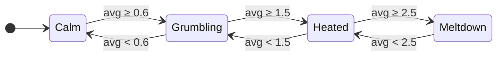

# WTF meter

> The only valid measurement of code quality: WTFs/minute.

A Claude Code mod that keeps score of the swearing in your prompts and shows how heated the session is getting. It understands English, Russian and Ukrainian.

- **Stamps.** Each message you send that scored gets a tag like `[WTF +3 · бля]`.
- **Heat strip.** A row above the prompt with one bar per message. Bar height is that message's score, bar color is the session level when it landed.
- **Status line.** `WTF 7 · 0.6/msg ▲ Heated`
- **Toast** when the session changes level: `Heated → Meltdown. Maybe git stash and get a coffee.`
- **`/wtf`** prints the tally and brings the strip back after you hid it.

Works in the Claude Code terminal and in the Code tab of the Claude desktop app.

## Install

Needs a Claude Code build with function-hook mods (early access; built against 2.1.293).

```
/plugin marketplace add dreamiurg/wtf-meter
/plugin install wtf-meter@wtf-meter
```

Or from a shell:

```bash
claude plugin marketplace add dreamiurg/wtf-meter
claude plugin install wtf-meter@wtf-meter
```

Start a new session after installing.

## Levels

The level is the average score of your last 4 messages, so one bad message can jump more than one level.



## Scoring

Every word in [`hooks/lexicon.ts`](hooks/lexicon.ts) has a weight: 1 mild (`damn`, `блин`, `дідько`), 2 medium (`wtf`, `сука`, `курва`), 3 strong (the f-word and the mat roots). Censored spellings that dictation tools produce (`f***`, `п***ц`) count too.

Russian and Ukrainian share most of the mat roots, so they share patterns. Each pattern needs a non-letter before it, because JavaScript's `\b` does not see Cyrillic. That keeps `корабля`, `употреблять`, `Херсон`, `блины`, `чертёж`, `hello` and `class` clean. Known miss: `Ебург`.

Only what you type counts. Background task notifications, scheduled prompts and messages from other agents are skipped.

## Privacy

Nothing leaves your machine. Scores live in the session's own state and go away with the session. The mod never changes what Claude reads: the stamps change only how your message is drawn.

## Develop

```bash
claude plugin validate .
claude plugin test .
```

Run a session with `claude --plugin-dir .` to load your working copy; saving a file reloads it.

## License

MIT
